

# Projeto Happy 2.0

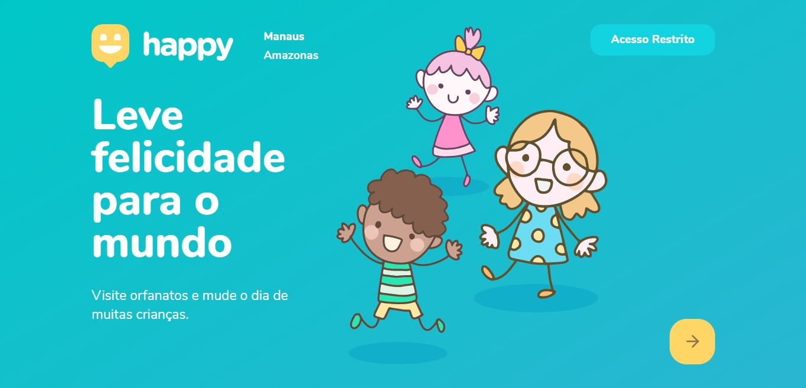

## Objetivo

Aprender tecnologias mais utilizadas no mercado como React e React Native, NodeJS e muito mais.

## O que é

Este projeto faz parte da Next Level Week 3.0 da Rocketseat, que consiste em uma série de 5 vídeo-aulas ensinando a como trabalhar com as tecnologias mais utilizadas no mercado, tudo na prática. Neste repositório estão os arquivos tanto do frontend quanto do backend da aplicação, assim como a versão mobile.

A aplicação consiste em auxiliar as pessoas a encontrarem orfanatos próximos a elas e assim criar oportunidades para doações, visitações e muito mais, com o intuito de melhorar um pouco a vida das crianças dos orfanatos em seu dia especial.

## Atualização

O projeto sofreu uma atualização por conta dos desafios propostos ao final do evento da Next Level Week 3.0, sendo adicionadas as seguintes funcionalidades:

> Layout
- Refeito layout da versão web
- Refeito layout da versão mobile

> Acesso Restrito
- Login
- Cadastro
- Recuperação de senha
- Lembrar usuário no próximo acesso

> Dashboard
- Editar, rejeitar e aceitar cadastros pendentes de orfanatos
- Editar e excluir orfanatos cadastrados
- Acessível através do acesso restrito

> Listagem de orfanatos
- Agora apenas os orfanatos com cadastro confirmado na Dashboard aparecem no mapa

> Display de imagens do orfanato (mobile)
- Agora o display das imagens do orfanato possui paginação para melhor UX

### Tecnologias utilizadas

- React
- React Native
- Expo
  - AsyncStorage
  - Location
- Node
  - Express
  - Axios
  - Cors
- Typeorm
- SQLite3
 

## Sumário

- [Instalação](#instalação)
  - [Configurando os arquivos do projeto](#configurando-os-arquivos-do-projeto)
  - [Servidor](#servidor)
  - [Aplicação Web](#aplicação-web)
  - [Aplicação Mobile](#aplicação-mobile)
- [Imagens do projeto](#imagens-do-projeto)
- [Sobre](#sobre)

[Voltar ao topo](#projeto-happy-20)

## Instalação

### Configurando os arquivos do projeto
Para instalar o projeto da aplicação em sua máquina, siga os passos a seguir:

0. Antes de tudo, verifique se você tem instalado em sua máquina o NPM ou YARN;
1. Clone este repositório;
1. Abra o terminal de sua preferência na pasta do repositório clonado;
1. Usuários NPM: execute `npm install` | Usuários YARN: execute `yarn add` para instalar todas as dependências do projeto.

### Servidor
Agora que você possui todos os arquivos necessários para rodar o projeto, primeiro você deve iniciar o servidor backend da aplicação, seguindo os passos abaixo:

1. Na pasta `server`: usuários NPM: execute `npm run typeorm migration:run` | usuários YARN: execute `yarn typeorm migration:run` para configurar o banco de dados da aplicação;
1. Após o banco de dados ser configurado: usuários NPM: execute `npm start` | usuários YARN: execute `yarn start` para rodar o servidor na porta 3333.

Com o servidor rodando, agora você pode escolher entre rodar a versão web ou mobile da aplicação, seguindo os passos a seguir:

### Aplicação Web
Apenas entre na pasta `web`, abra o terminal e execute: usuários NPM: `npm start` | usuários YARN: `yarn start` para rodar a aplicação na porta 3000.

### Aplicação Mobile
1. Para rodar a aplicação mobile, você deve fazer o download do expo em seu dispositivo móvel ou em um emulador;
1. Com o expo instalado, entre na pasta `mobile` e abra o terminal;
1. Usuários NPM: execute `npm start` | Usuários YARN: execute `yarn start` para iniciar o servidor expo da aplicação;
1. Abra o aplicativo do expo no seu celular ou emulador e abra o projeto iniciado na etapa anterior utilizando o QRCode ou digitando o endereço ip do servidor.

> IMPORTANTE: antes de iniciar a aplicação mobile, configure para que o endereço ip da aplicação esteja de acordo com a conexão de internet que está utilizando!
Para fazer isso, siga os passos a seguir:

1. Na pasta `mobile`, acesse o arquivo localizado em `src/services/api.ts`;
1. Dentro do arquivo, altere o endereço ip antes da porta 3333 para o seu endereço ip.

[Voltar ao sumário](#sumário)  
[Voltar ao topo](#projeto-happy-20)

## Imagens do projeto

### Versão Web

#### Página da home
  

#### Acesso restrito - login
  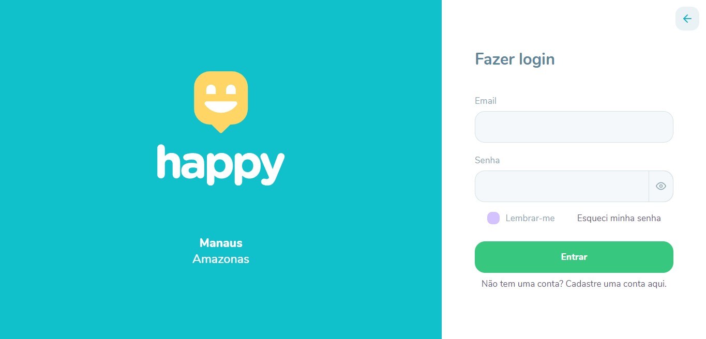

  
#### Acesso restrito - cadastro
  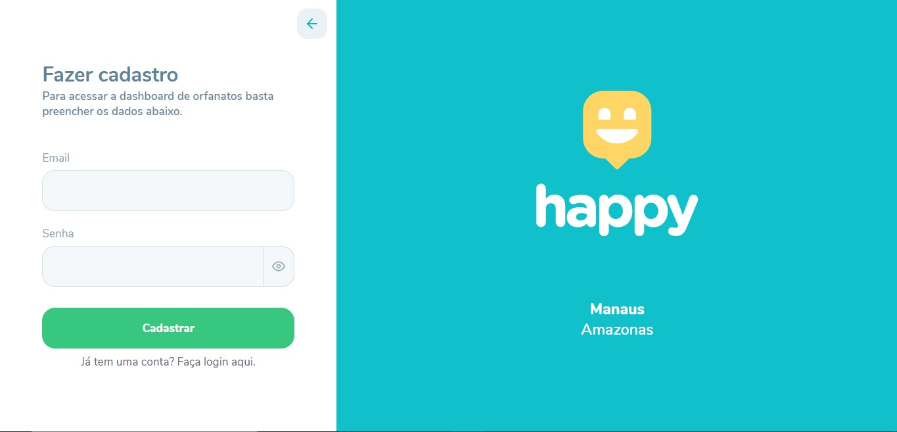

#### Página de 'Esqueci a Senha'
  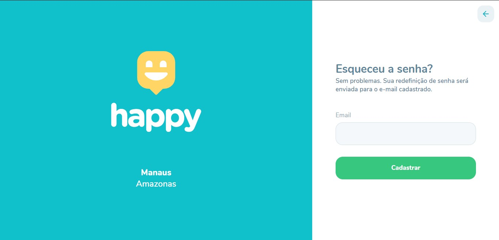

#### Página do mapa de orfanatos
  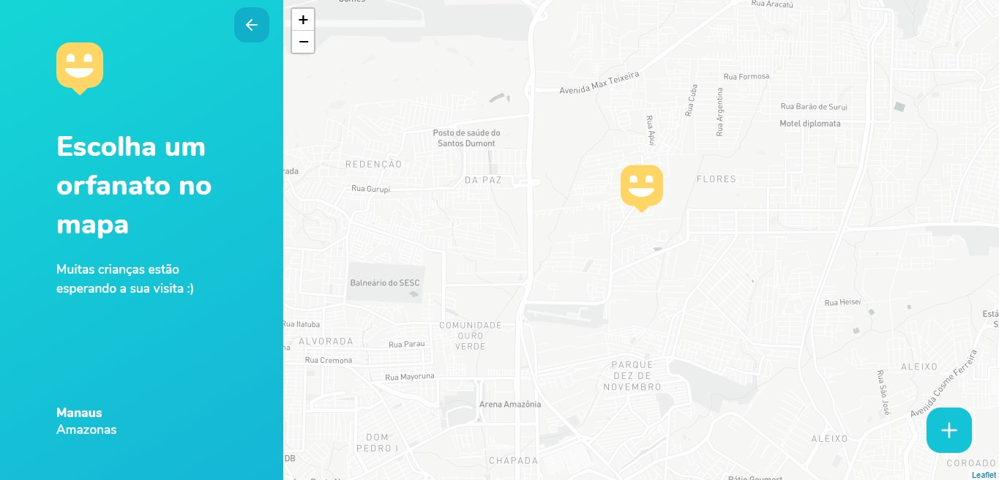

#### Página de cadastro de orfanato
  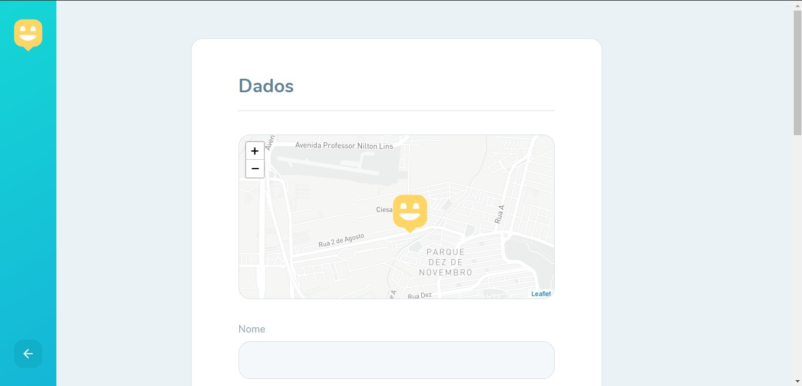

#### Página de detalhes do orfanato
  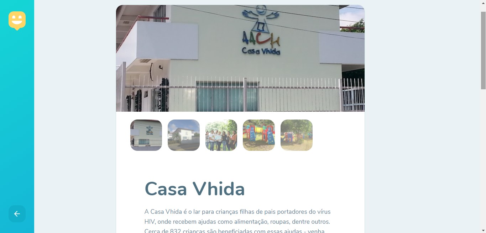

### Versão Mobile

#### Telas de onboarding
  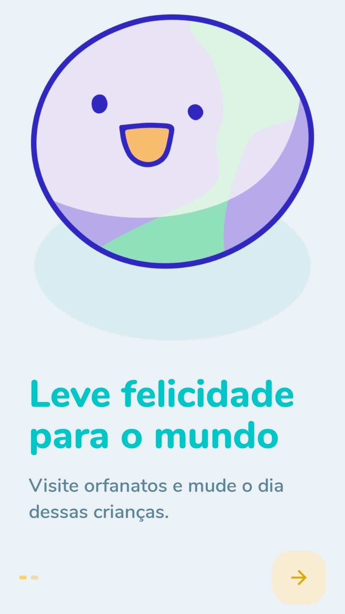 

#### Tela do mapa - Tela de detalhes do orfanato
  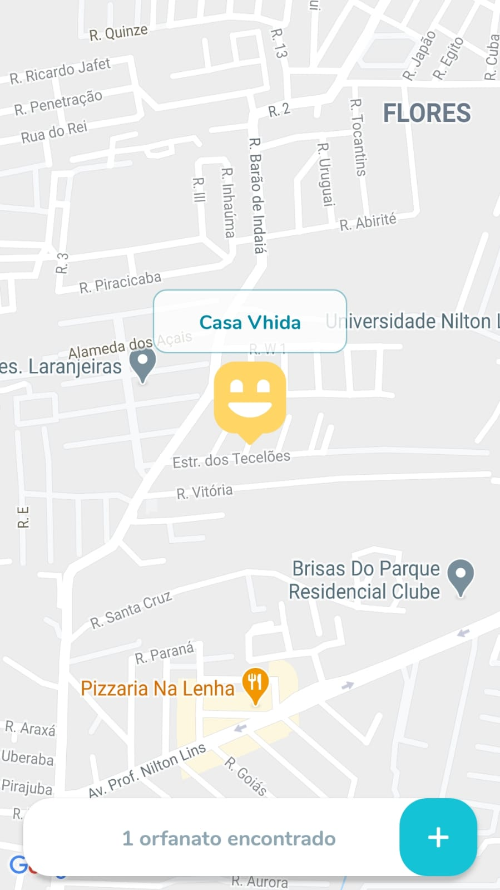 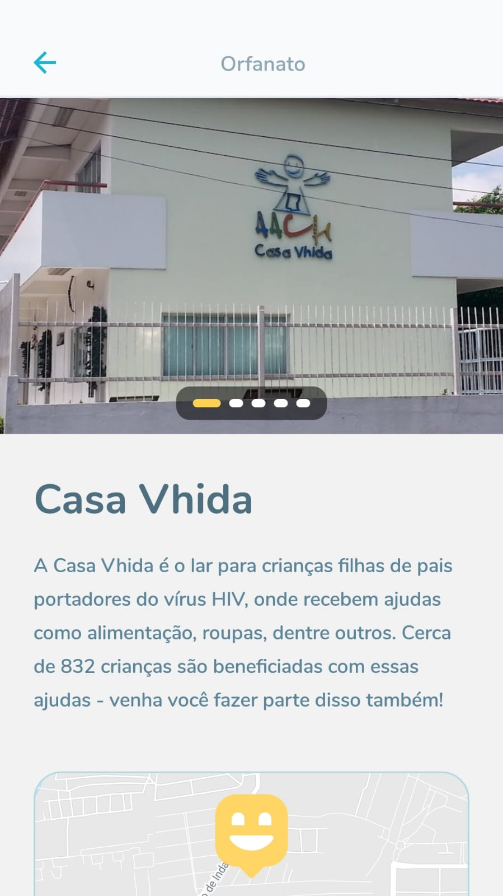
  

#### Tela de ajuda - Tela de escolher ponto no mapa
  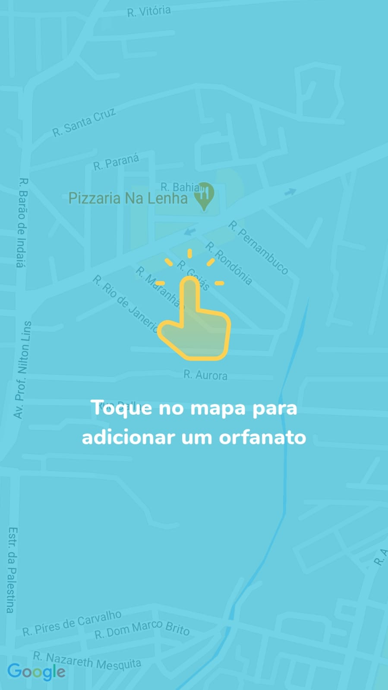 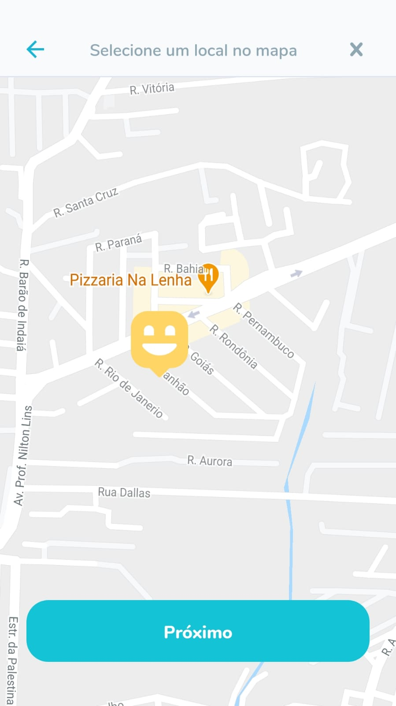

#### Tela de dados do orfanato - Tela de visitação do orfanato
  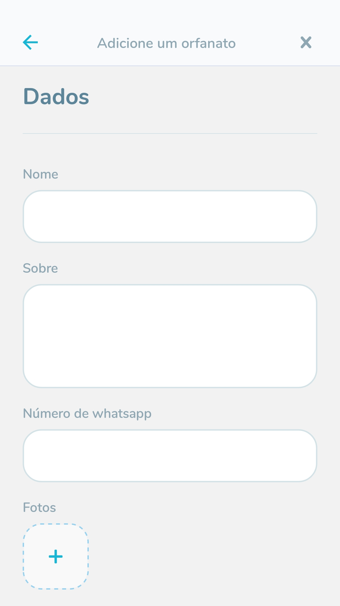 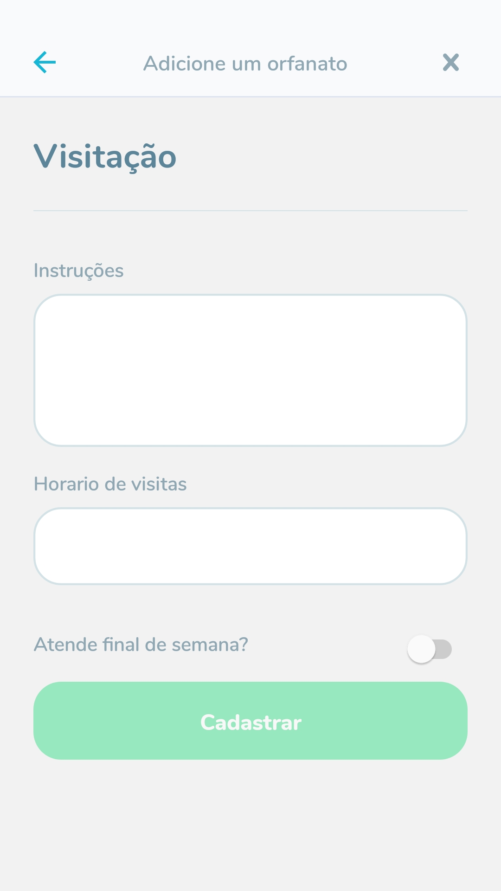

[Voltar ao sumário](#sumário)  
[Voltar ao topo](#projeto-happy-20)

## Sobre

- Github - [GabrielMCavalcante](https://github.com/GabrielMCavalcante)

- LinkedIn - [Gabriel Cavalcante](https://linkedin.com/in/gabrielmcavalcante)

[Voltar ao sumário](#sumário)  
[Voltar ao topo](#projeto-happy-20)
